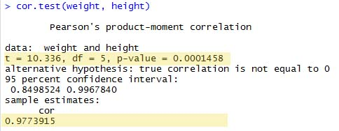

# linear_regression_workshop
This a simple linear regression using R programming

## Regression
Definition. Regression is a statistical tool that utilizes the relation
between two or more quantitative variables so that one variable
can be predicted from the other(s)

## Two types of Variables
## 1. Dependent variable
- response variable, outcome
- variable we want to predict
## 2. Independent variable
- explanatory variable, predictor variable, regressor
- the variable(s) used to predict the value of the dependent variable.

Example of Hypothesis
- Advertising expendetures predict quarterly sales.
- Number of dependents predicts employee prescription drug expenses.
- Apartment size predicts montnly rent.
- Number of dinners predict business lunch expense.
- Assembly line speed predicts number of product defects.

More specific form
- How much extra sales will be genrated, on average, by a 1 million increase in advertising expendetures?
  What would expected sales be with no advertising?
  
- How much do prescription drug cost per employee rise, on average, with each extra dependent?
  What would be the expected cost if the employee had no dependents?
  
- How much extra rent, on average, is paid per extra square foot?

- How much extra luncheon cost, on average, is generated by each additional members of the group?
  How much could be saved by restricting lucheon groups to three person?
  
- If the assembly line speed is increase by 20 units per hour, what would happend to the mean number of product defects?
  
 
## Interpreting a fitted regression

### Sales = 268 + 7.37 Ads
- Each extra 1 million of advertising will generate 7.37 million of sales on average.
  The firm would average 268 million of sales with zero advertising. However, the intercept may not be meaningful beacause Ads=0 may be outside the observed data.

### DrugCost = 410 + 550 Dependents
- Each extra dependents raises the mean annual prescription drug cost by 550 pesos. An employee with zero dependents averages 410 pesos in prescription drugs.

### Rent = 150 + 1.05 SqFt
- Each extra square foot adds 1.05 pesos to monthly apartment rent. The intercept is not meaningful because no apartment can have SqFt = 0.

### Cost = 15.22 + 19.96 Persons
- Each additional dinner increase the mean dinner cost 19.96 pesos. The intercept in not meaningful because Persons = 0 would not be observable.

### Defect = 3.2 + 0.045 Speed
- Each unit increase in assembly line speed adds an average of 0.045 defects per million. The intercept is not meaningful since zero assembly line speed implies no production at all.

## Prediction Using Regression
### Sales = 268 + 7.37 Ads
- If the firm spends 10 million on advertising, its expected sales would be 341.7 million, that is,
- Sales = 268 + 7.37(10) = 341.7.

### DrugCost = 410 + 550 Dependents
- If an employee has four dependents, the expected annual drug cost would be 2,610, that is
- DrugCost = 410 + 550(4) = 2,610.

### Rent = 150 + 1.05 SqFt
- The expected rent on an 800 square foot apartment is 990, that is
-  Rent = 150 + 1.05 (800) = 990

### Cost = 15.22 + 19.96 Persons
- The expected cost of dinner for two couples would be 95.06 pesos, that is,
- Cost = 15.22 + 19.96 (4) = 95.06

### Defect = 3.2 + 0.045 Speed
- If 100 units per hour are produced, the expected defect rate is 7.7 defects per million, that is,
- Defect = 3.2 + 0.045 (100) = 7.7

## Simple Linear Regression using R
### Test for Significance
- Step1: Draw the scatter plot diagram
- Step2: Test for significance using correlation

Consider: Heights and Weights of Seven People

Given a person’s height, can we
predict the person’s weight?

How can we best describe the
relationship between height and
weight?

Subject Height
(inches)
Weight (lbs)
1 68 155
2 61 99
3 63 115
4 70 190
5 69 170
6 65 125
7 72 18
